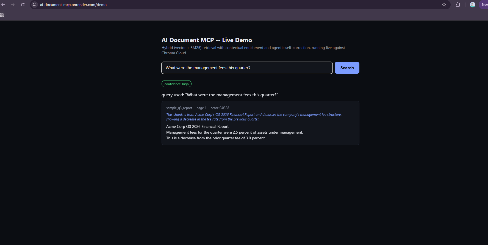
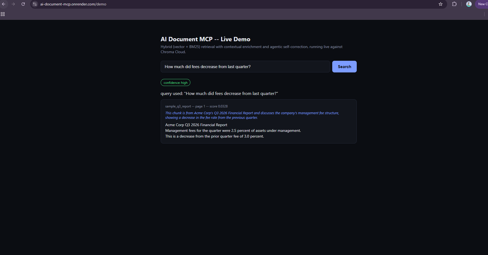
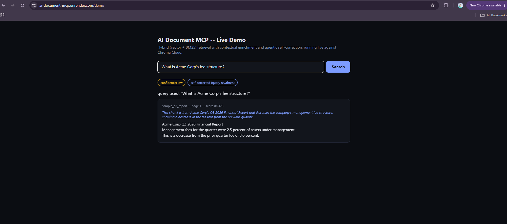
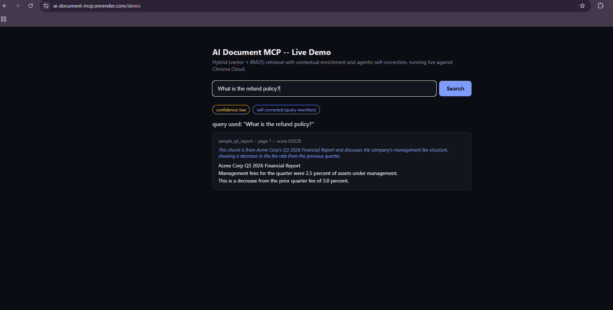

# AI Document Processing MCP Server

**A production-hardened document ingestion and hybrid RAG server, exposed over the Model Context Protocol (MCP), with contextual retrieval and agentic self-correction.**

🔗 **[Try it live — search real documents in your browser](https://ai-document-mcp.onrender.com/demo)**
🔗 **MCP endpoint (for AI clients/agents):** `https://ai-document-mcp.onrender.com/mcp`

> Note: this runs on a free hosting tier that spins down after inactivity. The first request after idle time can take up to ~50 seconds to wake up — after that, it responds normally.

---

## Why this project exists

Most "RAG demo" projects on GitHub stop at "embed some text, do a vector search." That's table stakes in 2026, not a differentiator. This project goes one tier further, on purpose:

1. **Contextual retrieval** — each chunk is enriched with a short, model-generated note about where it fits in the source document *before* it's embedded, fixing the classic RAG failure where a chunk like "the fee is 2%" is retrievable but meaningless on its own.
2. **Hybrid search** — vector search (semantic meaning) and BM25 keyword search (exact-term matches) are merged with Reciprocal Rank Fusion, a real, standard fusion technique, not a hand-rolled score blend.
3. **Agentic self-correction** — after retrieving, a cheap model judges whether the results actually look sufficient. If not, the query is reformulated and retried once, and the system is honest about its confidence in the final answer rather than silently returning weak results.

Both (1) and (3) are genuine 2026 industry techniques — contextual retrieval is a published Anthropic production technique, and reasoning-driven, self-correcting retrieval is the direction the field is actively moving, not a research toy.

---

## See it working, live

The screenshots below are **real, unedited outputs** from the live deployed server (not a mockup) — you can reproduce every one of them yourself at the [live demo link](https://ai-document-mcp.onrender.com/demo) in under a minute.

### High-confidence retrieval, with visible contextual grounding

A query the system can genuinely answer returns real results and a `confidence: high` badge, with the context note visible right in the result:





### Honest self-correction, instead of hallucination

When a query doesn't actually match anything in the ingested documents, the system doesn't fabricate an answer — it visibly attempts a query reformulation (`self-corrected (query rewritten)`), then reports low confidence rather than pretending it found something relevant:





This is the actual point of the agentic layer: a system that knows when it doesn't know, instead of a naive pipeline that always returns *something* whether or not it's right.

---

## Architecture

PDF upload
│
▼
┌─────────────────────────────────────────┐
│ Extraction │
│ • Text-native pages → PyMuPDF (free) │
│ • Scanned/image pages → Claude vision │
│ OCR (only pages that actually need it)│
└─────────────────────────────────────────┘
│
▼
┌─────────────────────────────────────────┐
│ Chunking + Contextual Enrichment │
│ • Sliding-window chunking w/ overlap │
│ • Each chunk gets an LLM-generated │
│ "where does this fit" context note │
│ before embedding │
└─────────────────────────────────────────┘
│
▼
┌─────────────────────────────────────────┐
│ Storage — Chroma Cloud │
│ Enriched text embedded; raw text, │
│ context note, page number kept as │
│ metadata for clean display later │
└─────────────────────────────────────────┘
│
▼
┌─────────────────────────────────────────┐
│ Hybrid + Agentic Retrieval │
│ • Vector search + BM25, merged via RRF │
│ • Confidence check on results │
│ • If weak: reformulate query, retry │
│ once, keep whichever attempt is │
│ actually better │
└─────────────────────────────────────────┘
│
▼
Exposed as MCP tools (ingest_document, search_documents,
get_document_status) AND as a plain HTTP/JSON demo endpoint


**Stack:** FastMCP (server framework) · Anthropic Claude Haiku (vision OCR, contextual enrichment, confidence checks — routed to the cheap/fast tier deliberately) · Chroma Cloud (vector storage) · PyMuPDF (text extraction) · `rank-bm25` (keyword search) · Docker · GitHub Actions CI · Render (deployment)

---

## Engineering practices demonstrated

This wasn't just "make it work once" — every piece below was actually verified, not assumed:

- ✅ **13 automated tests**, split by cost: 11 free unit/logic tests run on every commit; 2 tests that make real API calls (vision OCR, full ingest+search round trip) are explicitly marked and excluded from routine CI runs, so the test suite never silently burns API credit
- ✅ **CI on every push** — lint (`ruff`), type-check (`mypy`), and test, on a clean GitHub Actions runner, independent of any local environment
- ✅ **Zero `ruff`/`mypy` findings** — including fixing real issues like unsafe API response typing (`response.content[0].text` assumed a shape that wasn't actually guaranteed by the SDK's types) and `zip()` calls without `strict=True` that could silently truncate mismatched data
- ✅ **Dockerized and verified** — built, run, and manually smoke-tested locally before ever deploying
- ✅ **Deployed and reachable** — a real public URL, verified with a full MCP protocol handshake and tool call via `curl`, independent of any UI
- ✅ **Cost-aware by design** — OCR only runs on pages that actually need it (text-native pages are free); all LLM calls use the cheap/fast model tier; embeddings use Chroma's free local model, not a paid API
- ✅ **Guardrails** — file size limits, PDF-signature validation, and safe base64 decoding on the ingestion path before anything touches an LLM or the database

---

## MCP Tools

| Tool | What it does |
|---|---|
| `ingest_document(document_id, pdf_base64)` | Extracts, chunks, contextually enriches, and stores a PDF. Handles both text-native and scanned documents. |
| `search_documents(query, n_results=5)` | Hybrid + agentic retrieval. Returns results, the query actually used (which may differ from the input if self-corrected), a confidence rating, and whether self-correction fired. |
| `get_document_status(document_id)` | Checks how much of a given document is currently stored. |

## Running it yourself

```bash
git clone https://github.com/rajmyagentit-del/ai-document-mcp.git
cd ai-document-mcp
pip install -e ".[dev]"

# Requires ANTHROPIC_API_KEY, CHROMA_API_KEY, CHROMA_TENANT, CHROMA_DATABASE in your environment
pytest -v                    # free tests only
pytest -m costs_money -v     # tests that make real API calls

docker build -t ai-document-mcp .
docker run -p 8000:8000 --env-file .env ai-document-mcp
```

## Known limitations

- Free-tier hosting means the live demo cold-starts after inactivity (~50s first request)
- Single bounded self-correction retry (by design — an unbounded agent loop would make cost/latency unpredictable)
- BM25 index is rebuilt per query rather than persisted, which is fine at portfolio scale but wouldn't scale to a large document corpus without change

## License

MIT
